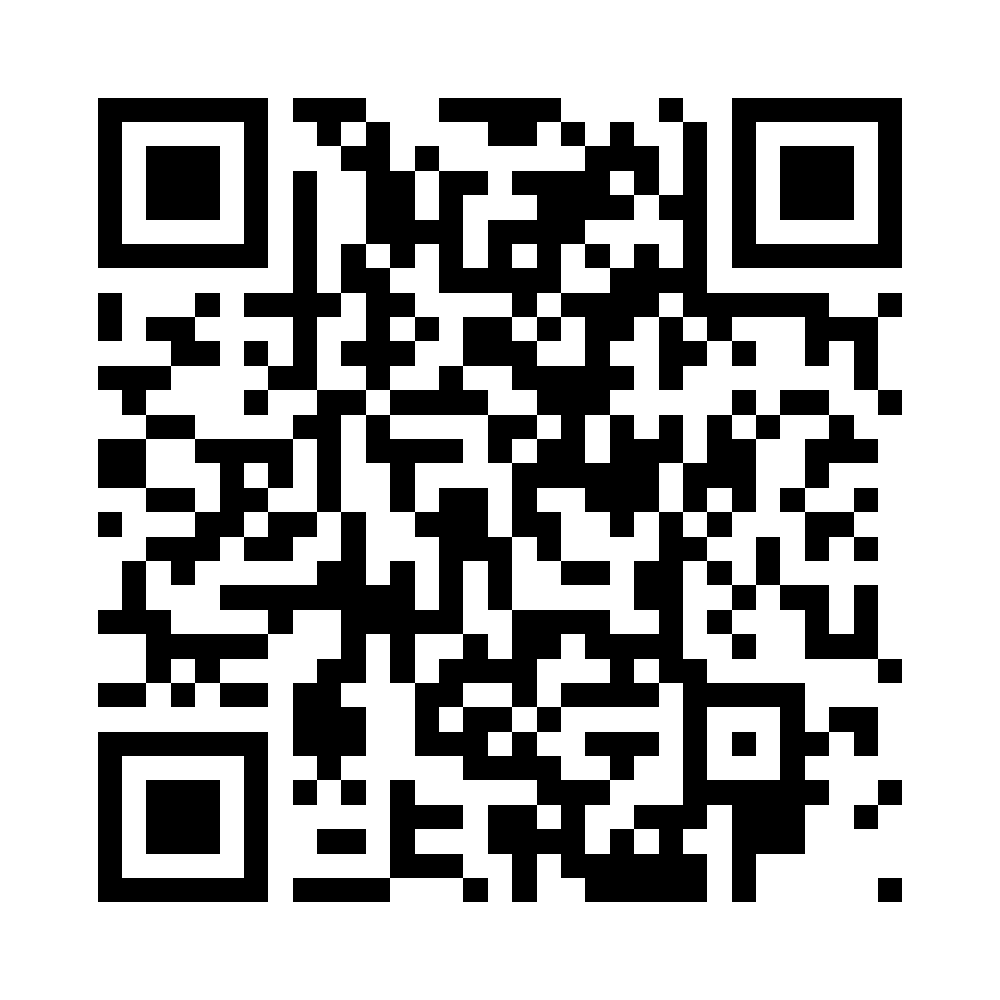

# Đi tìm liên kết

Trên màn hình có một câu hỏi cố định, trong kho có các mảnh ý rời (lẫn mảnh giả) — người chơi sắp
chúng theo đúng thứ tự để ra câu trả lời. Máy chấm tự động. 10 bàn chơi cho buổi 2 đến buổi 11.
Sinh viên chơi trên điện thoại, chia phòng theo nhóm.

- **Vào chơi:** https://haianhhadang-collab.github.io/haidvt2/

---

Câu hỏi và trích dẫn lấy từ **Giáo trình Tư tưởng Hồ Chí Minh 2026**.
Kho này chỉ chứa học liệu phát cho sinh viên — không có đề thi, bản giáo trình hay danh sách lớp.
